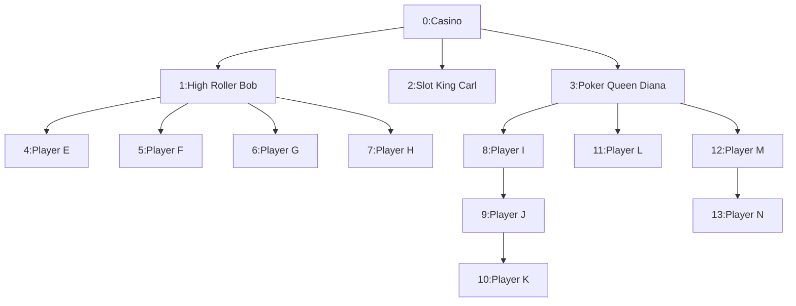

# 🎰 The High Roller's Network

## The Big Game

Welcome to QTech VIP Digital, the most ambitious online casino platform in the
making! We're building a revolutionary system to track our VIP relationships,
gaming hierarchies, and player networks. Just like Vegas itself, everything in
our world is connected, flowing from the top whales down to the everyday
players.

## The House Always Needs Structure

In our casino, every player is a node in an intricate network of relationships.
Think of it like our exclusive VIP referral system:

* The Casino (root node, ID: 0) sits at the top
* High Rollers (parent nodes) bring in their connections
* Regular players (child nodes) bring in their friends
* New players (leaf nodes) are just starting their journey

Here's how our current network looks:



## Your Mission: Build The Ultimate Player Network System

We need a sophisticated API service that can manage our entire player network.
Here's what's at stake:

1. Welcome New Players to the Table
    * Add new players under their referrers
    * Track who brought whom to the casino
    * Maintain the referral chain integrity
2. Player Checkout
    * Handle players leaving the network
    * Maintain remaining connections
    * Clean historical data properly
3. VIP Host Reassignment
    * Transfer players between different VIP hosts
    * Update referral chains without losing history
    * Maintain commission structures
4. The Million Dollar Question - Network Tracking
    * This is where the big money is! Given any player in our network, we need
      to see their entire downline.

### For example

> [!NOTE]  
> This are references, no arquitectural desing or references, we encourage you
> to update or change base on your criteria.

* Query the Casino's entire network (ID: 0):
  * Example request:

    ```shell
    curl --url "https://myserver/api/network/0/downline.json"
    ```

  * Example response

    ```json
    {
      "nodes": [
        {"id": 1, "name": "High Roller Bob"},
        {"id": 4, "name": "Player E"},
        {"id": 5, "name": "Player F"},
        {"id": 6, "name": "Player G"},
        {"id": 7, "name": "Player H"},
        {"id": 2, "name": "Slot King Carl"},
        {"id": 3, "name": "Poker Queen Diana"},
        {"id": 8, "name": "Player I"},
        {"id": 9, "name": "Player J"},
        {"id": 10, "name": "Player K"},
        {"id": 11, "name": "Player L"},
        {"id": 12, "name": "Player M"},
        {"id": 13, "name": "Player N"}
      ]
    }
    ```

    or

  * Example request:

    ```shell
    curl --url "https://myserver/api/network/0/downline.xml"
    ```

  * Example response

    ```XML
    <nodes>
      <node>
        <id>1</id>
        <name>High Roller Bob</name>
      </node>
      <node>
        <id>4</id>
        <name>Player E</name>
      </node>
      <node>
        <id>5</id>
        <name>Player F</name>
      </node>
      <node>
        <id>6</id>
        <name>Player G</name>
      </node>
      <node>
        <id>7</id>
        <name>Player H</name>
      </node>
      <node>
        <id>2</id>
        <name>Slot King Carl</name>
      </node>
      <node>
        <id>3</id>
        <name>Poker Queen Diana</name>
      </node>
      <node>
        <id>8</id>
        <name>Player I</name>
      </node>
      <node>
        <id>9</id>
        <name>Player J</name>
      </node>
      <node>
        <id>10</id>
        <name>Player K</name>
      </node>
      <node>
        <id>11</id>
        <name>Player L</name>
      </node>
      <node>
        <id>12</id>
        <name>Player M</name>
      </node>
      <node>
        <id>13</id>
        <name>Player N</name>
      </node>
    </nodes>
    ```

    >(Every player in the house!)

* Query Poker Queen Diana's network (ID: 3):
  * Example request:

    ```shell
    curl --url "https://myserver/api/network/3/downline.json"
    ```

  * Example response

    ```json
    {
      "nodes": [
        {"id": 8, "name": "Player I"},
        {"id": 9, "name": "Player J"},
        {"id": 10, "name": "Player K"},
        {"id": 11, "name": "Player L"},
        {"id": 12, "name": "Player M"},
        {"id": 13, "name": "Player N"}
      ]
    }
    ```

* Query High Roller Bob's network (ID: 1):
  * Example request:

    ```shell
    curl --url "https://myserver/api/network/1/downline.json"
    ```

  * Example response

    ```json
    {
      "nodes": [
        {"id": 4, "name": "Player E"},
        {"id": 5, "name": "Player F"},
        {"id": 6, "name": "Player G"},
        {"id": 7, "name": "Player H"}
      ]
    }
    ```

* Query Slot King Carl's network (ID: 2):
  * Example request:

    ```shell
    curl --url "https://myserver/api/network/2/downline.xml"
    ```

  * Example response

    ```xml
    <nodes>
    </nodes>
    ```

    > (Looks like Carl needs to step up his game!)

## The Tech Stack (House Rules)

Build your system using:

* Spring Boot (latest) - as reliable as our slot machines
* Java 17+ - faster than a dealer's shuffle
* Any RDBMS/NoSQL - your chips, your choice
* Maven/Gradle - house tools

## Requirements (Casino Compliance)

Your API must:

* Follow REST best practices (we run a clean house)
* Support both JSON and XML (for our international players)
* Use proper HTTP status codes (like our precise payout systems)
* Use proper HTTP Verbs (We speak like proper Gentlemen or Ladies)
* Include proper documentation (house rules must be clear)

We highly encourage you to commit frequently. Your commit history should serve
as a window into your thought process—each commit a play in your winning
strategy. We will be reviewing your commit progress as part of our evaluation.

## Time to Show Your Hand

You have 5 days to build this system. Like any good poker player, show us:

* How to run it
* How to use it
* How to test it

Bonus chips if you show creativity and **WOW!! Effect!**, we like to be
surprised.

Remember: What happens in the API, stays in the API. Keep it clean, keep it
professional, and make it scale like a Vegas weekend.

Good luck, and may the odds be ever in your favour! 🎲
