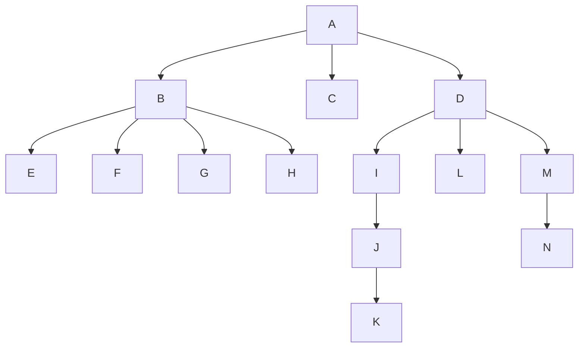

# java-nodes

## Challenge

Data tree structure is a way to organize and store data in hierarchical form. It
composed of nodes each connected by lines/edges. A parent node is a node
connected to another node downline. The downline node is a called a child node.
A child node can have its own children. A node with no children is called a leaf
node. The root node is the top most node and it doesn’t have any parent. Each
child node can only be a child of one parent node.

Please create a restful API service (no UI) for node management system. It should
have the following functionalities:

1. Add nodes
    * Given a node, user should be able to add a child to that node
1. Delete nodes
    * Given a node, user should be able to delete a child of that node
1. move nodes from one parent to another
    * Given a node, a user should be able to transfer it to a different parent.
1. return the list of all downline nodes. For example, in the structure above,
    * Given a user invoked the endpoint to get he child nodes of A, response will
      be `[B, C, D, E, F, G, H, I, J, K, L, M, N]`
    * Given a user invoked the endpoint to get he child nodes of D, response will
      be `[I, J, K, L, M, N]`
    * Given a user invoked the endpoint to get he child nodes of C, response will
      be `[ ]`

The application can start with a pre defined root node.

## Requirements

* Please use
  * springboot, latest version
  * java 17 or later versions
  * any rdbms or no sql database
  * maven or gradle
* Append to this file how to `run`/`use`/`test` your app. if your app is able to
  host or include a generated **how to use my web service** it would be cool but
  not required
* Apply REST best practices in terms of endpoint design, proper status
  xheaders for the operations, correct use of HTTP Verbs, content negotiation
  and entity representation.
* Support json and xml as content-type

## Submission

Deadline, 5 days after receip the invitation
